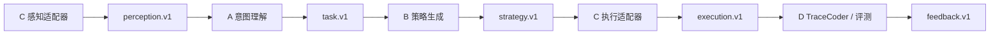

# Isaac 执行器 V1 联调接口说明

适用对象：A（意图与目标绑定）、B（策略生成）、C（感知与执行，吴昌庆）、D（TraceCoder/评测）。本文说明当前已经实现并可本地验证的第一阶段 Mock 接口，以及后续离线 Isaac Sim 的替换边界。

## 1. 当前进度

第一阶段已经具备 `perception.v1` 和 `execution.v1` 适配器、五动作白名单解释器、步骤引用、有限恢复、安全停止和公共 pipeline 联调。运行它不需要服务器、Isaac Sim、CUDA 或外网。



当前 `C 执行适配器` 绑定 `MockBackend`。第二阶段只替换后端为 Offline Isaac，A/B/D 继续使用同样的 JSON 和适配器边界。

## 2. C 感知输出样例

仓库文件：[`../testdata/daily/stacking_scene.json`](../testdata/daily/stacking_scene.json)

```json
{
  "schema_version": "perception.v1",
  "scene_id": "stacking_cubes",
  "coordinate_frame": "world",
  "objects": [
    {
      "id": "red_cube",
      "category": "cube",
      "pose": {"x": 0.25, "y": 0.0, "z": 0.04},
      "dimensions": {"x": 0.04, "y": 0.04, "z": 0.04},
      "attributes": {"display_name": "红色方块", "color": "red"},
      "execution": {"movable": true, "graspable": true}
    },
    {
      "id": "green_cube",
      "category": "cube",
      "pose": {"x": 0.25, "y": 0.0, "z": 0.12},
      "dimensions": {"x": 0.04, "y": 0.04, "z": 0.04},
      "attributes": {"display_name": "绿色方块", "color": "green"},
      "execution": {"movable": true, "graspable": true}
    },
    {
      "id": "zone_unstack_target",
      "category": "target_zone",
      "pose": {"x": 0.4, "y": 0.0, "z": 0.03},
      "attributes": {"purpose": "safe_placement"},
      "execution": {
        "movable": false,
        "graspable": false,
        "valid_destination": true
      }
    }
  ],
  "execution_context": {"backend": "mock", "scene_revision": "1"}
}
```

### A 应该如何使用

1. 从 `objects` 中根据语言和属性绑定目标，但向下游只写稳定 `id`。
2. 目标物体必须具备任务需要的能力，例如抓取时检查 `execution.graspable`。
3. 目的地只能选择 `execution.valid_destination == true` 的对象。
4. 不要把中文 `display_name` 当作主键，也不要自行生成 C 未声明的坐标。

建议 A 输出的 `task.v1`：

```json
{
  "schema_version": "task.v1",
  "task_id": "stacking-demo-001",
  "action": "pick_and_place",
  "target_ids": ["green_cube"],
  "destination_id": "zone_unstack_target",
  "constraints": [],
  "status": "READY",
  "blocking_reasons": []
}
```

## 3. B 策略输入样例

仓库文件：[`../testdata/daily/stacking_strategy.json`](../testdata/daily/stacking_strategy.json)

```json
{
  "schema_version": "strategy.v1",
  "task_id": "stacking-demo-001",
  "steps": [
    {
      "step_id": "detect_green",
      "action": "detect_object",
      "arguments": {"object_id": "green_cube"}
    },
    {
      "step_id": "approach_green",
      "action": "move_to_object",
      "arguments": {"object_id": "$detect_green.object_id"}
    },
    {
      "step_id": "grasp_green",
      "action": "grasp",
      "arguments": {"object_id": "$detect_green.object_id"},
      "on_failure": {
        "max_attempts": 1,
        "steps": [
          {
            "step_id": "retry_grasp_green",
            "action": "grasp",
            "arguments": {"object_id": "$detect_green.object_id"}
          }
        ],
        "on_exhausted": "stop"
      }
    },
    {
      "step_id": "move_target",
      "action": "move_to_target",
      "arguments": {"destination_id": "zone_unstack_target"}
    },
    {
      "step_id": "release_green",
      "action": "release",
      "arguments": {}
    }
  ],
  "code": null
}
```

### B 只能生成这些动作

| 动作 | 接受参数 | 成功时可被后续引用的字段 |
|---|---|---|
| `detect_object` | 必须且只能用 `object_id` 或兼容别名 `object_name` 之一 | `object_id`、`pose` |
| `move_to_object` | 必须且只能用 `object_id` | `object_id` |
| `grasp` | 必须且只能用 `object_id` | `object_id` |
| `move_to_target` | 必须且只能用 `destination_id` 或兼容别名 `target` 之一 | `destination_id` |
| `release` | 必须是空对象 `{}` | `object_id` |

B 生成策略时还必须遵守：

- `task_id` 原样沿用 A 的任务 ID。
- `step_id` 在主步骤和所有恢复步骤中唯一。
- `$step_id.field` 只能引用已经执行的步骤。
- 主步骤不超过 50；单个恢复块不超过 10 步；`max_attempts` 为 1–3；`on_exhausted` 固定为 `stop`。
- 不提交自定义动作、任意坐标或可执行代码。
- 未经确认不得执行 `strategy.code`；第一阶段该字段只能是 `null` 或空字符串。

## 4. C 执行输出

调用方式：

```python
from integration.adapters.executor import ExecutorAdapter
from modules.executor.mock_backend import MockBackend

executor = ExecutorAdapter(MockBackend.from_perception(perception_v1))
execution_v1 = executor.run(strategy_v1)
```

成功输出的结构摘录如下。为便于阅读，`steps` 只展示第一条，`trajectory_points` 也省略了实际轨迹；程序的真实输出会保存全部五条主步骤和移动轨迹：

```json
{
  "schema_version": "execution.v1",
  "task_id": "stacking-demo-001",
  "status": "SUCCEEDED",
  "steps": [
    {
      "step_id": "detect_green",
      "phase": "main",
      "action": "detect_object",
      "arguments": {"object_id": "green_cube"},
      "status": "SUCCESS",
      "reason": null,
      "duration_ms": 10
    }
  ],
  "trajectory_points": [],
  "total_duration_ms": 460,
  "safety_events": []
}
```

顶层和步骤状态是两套枚举：

| 层级 | 状态 | 说明 |
|---|---|---|
| 顶层 | `SUCCEEDED` | 必要主流程完成 |
| 顶层 | `FAILED` | 普通业务失败或引用失败，未触发安全停止 |
| 顶层 | `SAFE_STOP` | 恢复耗尽、调用超限或安全门禁触发 |
| 步骤 | `SUCCESS` | 动作调用成功 |
| 步骤 | `FAILED` | 动作或引用失败 |
| 步骤 | `SKIPPED` | 因此前失败或安全停止未执行 |

## 5. 失败原因与安全事件

| 原因/事件 | 产生条件 | D 的处理建议 |
|---|---|---|
| `UNKNOWN_ACTION` | B 使用白名单外动作 | 归因给策略生成，禁止重试同一动作 |
| `INVALID_ARGUMENT` | 参数名、数量或结构不合法 | 返回 B 修正策略 |
| `UNRESOLVED_REFERENCE` | 引用不存在、未来步骤或字段缺失 | 检查步骤顺序与输出字段 |
| `OBJECT_NOT_FOUND` | perception 中没有该 ID | 返回 A/B 重新绑定目标 |
| `OBJECT_NOT_APPROACHED` | 未先移动到物体就抓取 | B 补足动作顺序 |
| `INVALID_DESTINATION` | 目标不存在或不是安全目标区 | A/B 只能使用 `valid_destination` ID |
| `INJECTED_FAILURE` | Mock 测试主动注入失败 | 用于验证恢复分支，不是实机故障 |
| `RECOVERY_EXHAUSTED` | 有限恢复仍未成功 | 顶层 `SAFE_STOP`，保留证据并停止 |
| `ACTION_LIMIT_EXCEEDED` | 总后端动作调用达到上限 | 顶层 `SAFE_STOP`，不得继续自动执行 |
| `BACKEND_SAFE_STOPPED` | 后端已停止后又收到动作 | 不得自动重试，先人工确认状态 |

### D 应该如何使用

1. 用 `task_id` 串联 task、strategy、execution 和 feedback。
2. 读取每条步骤的 `phase`、`action`、已解析 `arguments`、`status`、`reason` 和 `duration_ms`。
3. `SAFE_STOP` 时优先读取 `safety_events`，不要只看最后一个动作。
4. 诊断输出 `feedback.v1`，但不要直接执行未经白名单和人工确认的新代码。
5. Mock 的 `INJECTED_FAILURE` 应标成测试条件，避免误报为真实 Isaac 故障。

## 6. 本地联调与验收

在仓库根目录、项目约定的 `huawei` Conda 环境中执行：

```bash
python -m unittest discover -s tests -t . -v
```

只验证跨模块闭环：

```bash
python -m unittest discover -s tests/integration -t . -v
```

相关协议：

- [`../contracts/v1/perception.schema.json`](../contracts/v1/perception.schema.json)
- [`../contracts/v1/task.schema.json`](../contracts/v1/task.schema.json)
- [`../contracts/v1/strategy.schema.json`](../contracts/v1/strategy.schema.json)
- [`../contracts/v1/execution.schema.json`](../contracts/v1/execution.schema.json)
- [`../contracts/v1/feedback.schema.json`](../contracts/v1/feedback.schema.json)

## 7. 第一阶段不能证明什么

第一阶段通过只表示：接口字段、白名单、引用、恢复、安全停止以及公共 pipeline 的软件闭环正确。它不证明 Isaac Sim 已经成功加载场景，也不证明 RTX 渲染、碰撞、动力学、控制频率、真实轨迹或真机安全。

第二阶段需要在离线校内服务器上修复项目专属缓存目录权限，完成 Isaac Sim 探针，再实现同一适配器接口的 Offline Isaac 后端。服务器地址、账号、端口、绝对路径和日志不得写入本仓库。
